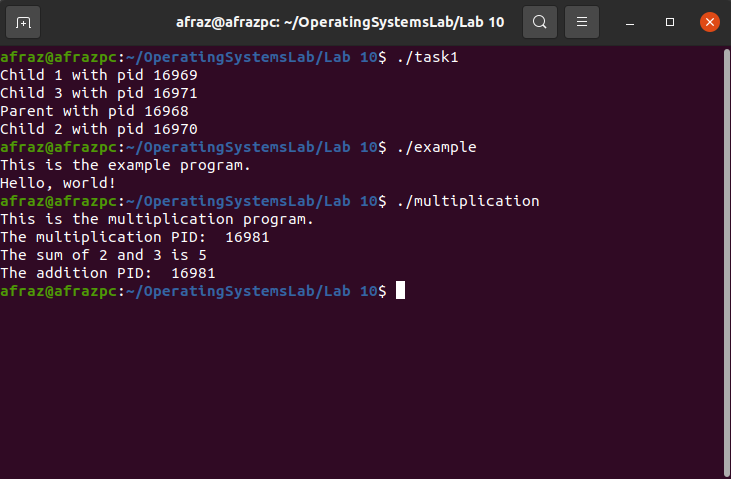
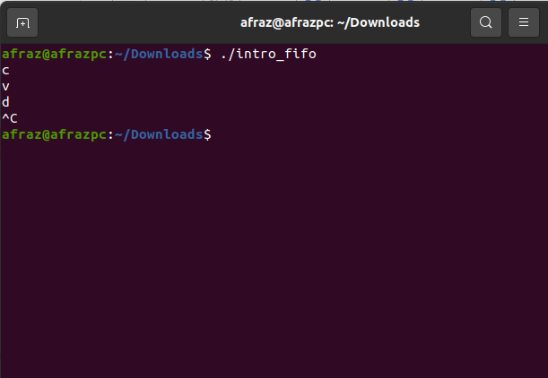
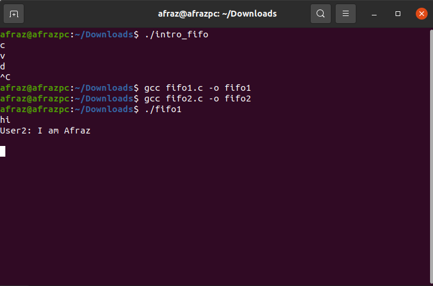
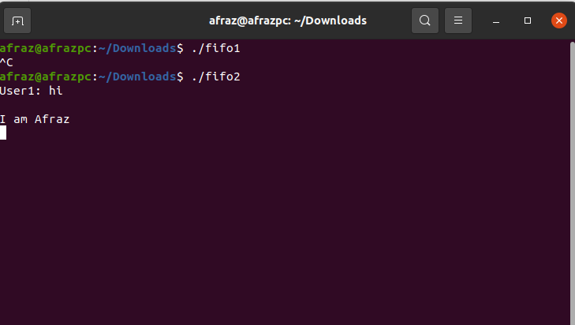

# Lab 12: Process Control

Process Control refers to the scenario where the Operating system controls as to what process is allowed on the memory or not. It is an integral part of the handling of processes.

## Functions to be studied today: 

1. Fork
2. Exec

## Fork: 

#### Syntax: 

```c
fork()				// copies the process
    /*
    	returns: int
    */
```

#### Description

The `fork()` function in C is used to create a new process by duplicating the existing process. The new process is referred to as the child process, while the original process is referred to as the parent process. The `fork()` function creates an exact copy of the parent process's memory space, including all the data, heap, and stack segments.

The `fork()` function returns an integer value. In the parent process, the return value is the process ID (PID) of the child process, while in the child process, the return value is 0. If an error occurs during the `fork()` system call, the return value is -1.

### Exec:

#### Syntax:

``````c
execv(<Path of the process>, Arguments)			//executes the process in-situ
    /*
    	Parameter 1: the path of the process to be implemented, a string
    	Parameter 2: Arguments to be passed to second file
    */
``````

#### Description

The  ```execv()``` function is used to execute the navigation of process from one process to another. Simply speaking, if we want to call process1 from within process2, we use exec.


### Sample Tasks

#### Task 1: Write a program to create one parent with three child using fork().

```c
#include <stdio.h>
#include <unistd.h>
#include<sys/wait.h>

int main() {
    for (int i = 0; i < 3; i++) {
        if (fork() == 0) {
            printf("Child %d with pid %d\n", i+1, getpid());
       	wait(NULL);
            return 0;
        }
    }
    wait(NULL);
    printf("Parent with pid %d\n", getpid());
    return 0;
}
```

This program uses a loop to create three childs. If fork returns 0 (child process) then ID is printed, and then parent is printed.

#### Task 2: Create two .c files, example and hello, and navigate from example to hello.

```c
// example.c file
#include <stdio.h>
#include <unistd.h>

int main() {
  printf("This is the example program.\n");
  char* args[] = {"./hello", NULL};
  execv(args[0], args);
  printf("This occurs after the transfer and is not printed.\n");
  return 0;
}
```

```c
// hello.c file
#include <stdio.h>

int main() {
  printf("Hello, world!\n");
  return 0;
}
```

The ``example.c`` uses arguments , path of the executable hello, and NULL because no arguments. Then the execv function is called, switching control of both files.

#### Task 3 : Create two .c files, multiplication and addition, and navigate from multiplication to addition.

```c
// multiplication.c file
#include <stdio.h>
#include <unistd.h>

int main() {
  printf("This is the multiplication program.\n");
  pid_t pid = getpid();
  printf("The multiplication PID:  %d\n", pid);
  char* args[] = {"./addition", NULL};
  execv(args[0], args);
  printf("This occurs after the transfer and is not printed.\n");
  return 0;
}
```

````c
// addition.c file
#include <stdio.h>
#include <unistd.h>

int main() {
  int a = 2, b = 3;
  printf("The sum of %d and %d is %d\n", a, b, a+b);
  pid_t pid = getpid();
  printf("The addition PID:  %d\n", pid);
  return 0;
}
````

The explanation is exactly the same as before, only that we have printed both PIDs of addition and multiplication.

### Outputs of the tasks:




## FIFO task chatbot:

#### Intro FIFO:

```c
// C program to implement one side of FIFO
// This side writes first, then reads
#include <stdio.h>
#include <string.h>
#include <fcntl.h>
#include <sys/stat.h>
#include <sys/types.h>
#include <errno.h>
#include <unistd.h>


int main()
{
   
    char * myfifo = "myfifo";

    mkfifo(myfifo, 0777);
    int fd = open("myfifo", O_WRONLY);
    int x=97;
    write(fd, &x, sizeof(x));
    close(fd);

    return 0;
}
```



#### FIFO Chatbot-1: 

```c
#include <stdio.h>
#include <string.h>
#include <fcntl.h>
#include <sys/stat.h>
#include <sys/types.h>
#include <errno.h>
#include <unistd.h>


int main()
{
    int fd;

    // FIFO file path
    char * myfifo = "/tmp/myfifo";

    // Creating the named file(FIFO)
    // mkfifo(<pathname>, <permission>)
    mkfifo(myfifo, 0666);

    char arr1[80], arr2[80];
    while (1)
    {
        // Open FIFO for write only
        fd = open(myfifo, O_WRONLY);

        // Take an input arr2ing from user.
        // 80 is maximum length
        fgets(arr2, 80, stdin);

        // Write the input arr2ing on FIFO
        // and close it
        write(fd, arr2, strlen(arr2)+1);
        close(fd);

        // Open FIFO for Read only
        fd = open(myfifo, O_RDONLY);

        // Read from FIFO
        read(fd, arr1, sizeof(arr1));

        // Print the read message
        printf("User2: %s\n", arr1);
        close(fd);
    }
    return 0;
}
```

### FIFO Chatbot-2:

```c
// C program to implement one side of FIFO
// This side reads first, then reads
#include <stdio.h>
#include <string.h>
#include <fcntl.h>
#include <sys/stat.h>
#include <sys/types.h>
#include <unistd.h>

int main()
{
    int fd1;

    // FIFO file path
    char * myfifo = "/tmp/myfifo";

    // Creating the named file(FIFO)
    // mkfifo(<pathname>,<permission>)
    mkfifo(myfifo, 0666);

    char str1[80], str2[80];
    while (1)
    {
        // First open in read only and read
        fd1 = open(myfifo,O_RDONLY);
        read(fd1, str1, 80);

        // Print the read string and close
        printf("User1: %s\n", str1);
        close(fd1);

        // Now open in write mode and write
        // string taken from user.
        fd1 = open(myfifo,O_WRONLY);
        fgets(str2, 80, stdin);
        write(fd1, str2, strlen(str2)+1);
        close(fd1);
    }
    return 0;
}
```



