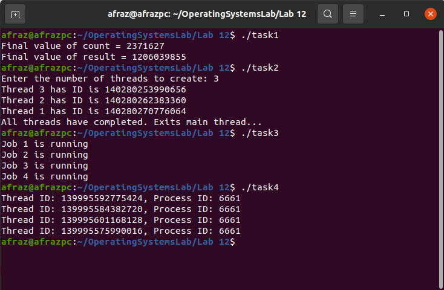

# Lab 13

The purpose of this lab is to get familiar with Threads. Thread is a lightweight process that shares some characteristics with its parent process and some things as its unique identifiers.

## Commands to know:

```c
#include <pthread.h>

int pthread_join(pthread_t thread, void **value_ptr);
```


**DESCRIPTION:**
	The pthread_join() function shall suspend execution of the calling thread until the target thread terminates, unless the target thread has already terminated. On return from a successful pthread_join() call with a non-NULL value_ptr argument, the value passed to pthread_exit() by the terminating thread shall be made available in the location referenced by value_ptr. When a pthread_join() returns successfully, the target thread has been terminated. The results of multiple simultaneous calls to pthread_join() specifying the same target thread are undefined. If the thread calling pthread_join() is canceled, then the target thread shall not be detached.

It is unspecified whether a thread that has exited but remains unjoined counts against {PTHREAD_THREADS_MAX}.

The behavior is undefined if the value specified by the thread argument to pthread_join() does not refer to a joinable thread.

The behavior is undefined if the value specified by the thread argument to pthread_join() refers to the calling thread.
	**RETURNS:** If successful, the pthread_join() function shall return zero; otherwise, an error number shall be returned to indicate the error.

```c
#include <pthread.h>

int pthread_create(pthread_t *thread, const pthread_attr_t *attr, void *(*start)(void *), void *arg);
```


**DESCRIPTION:** 
The pthread_create() function is used to create a new thread, with attributes specified by attr, within a process. If attr is NULL, the default attributes are used (see pthread_attr_init()). If the attribute object is modified later, the thread's attributes are not affected. If thread is not NULL, pthread_create() stores the ID of the created thread in the location referenced by thread.

At creation, the thread executes start, with arg as its sole argument. The calling function must ensure that arg remains valid for the new thread throughout its lifetime. If start returns, the effect as if there was an implicit call to pthread_exit() using the return value of start as the exit status. Note that the thread in which main() was originally invoked differs from this. When it returns from main(), the effect as if there was an implicit call to exit() using the return value of main() as the exit status.

The signal state of the new thread is initialized as follows:

The signal mask is inherited from the creating thread.
The set of signal pending for the new thread is empty.
If pthread_create() fails, no new thread is created and the contents of the location referenced by thread are undefined.

**RETURNS:** On success, pthread_create() returns 0.

## Tasks of the Lab:

#### Task 1 :  Write a program that contains 3 threads. each thread increment the global variable and then adds that value to the result which is another global variable. initialize result and other variable with 0. Output the final value of result and the other global variable. do this in c file.

```c
#include <stdio.h>
#include <pthread.h>

#define NUM_THREADS 3

int count = 0;      // global variable to be incremented
int result = 0;     // global variable to store sum of increments

void *thread_function(void *arg) {
    int i;
    for (i = 0; i < 1000000; i++) {
        count++;                // increment count
        result += count;        // add count to result
    }
    pthread_exit(NULL);
}

int main() {
    pthread_t threads[NUM_THREADS];
    int i;

    for (i = 0; i < NUM_THREADS; i++) {
        pthread_create(&threads[i], NULL, thread_function, NULL);
    }

    for (i = 0; i < NUM_THREADS; i++) {
        pthread_join(threads[i], NULL);
    }

    printf("Final value of count = %d\n", count);
    printf("Final value of result = %d\n", result);

    return 0;
}
```

This code creates three threads on an array. It uses ```pthread_create``` method to create threads, and then increment in each join, and then exit.

#### Task 2 :  Write a program that creates threads based on the input given by the user. each thread should  execute function print() and display its thread ID . The output should be like:

#### **Hello I am thread 1 my ID is 123**

**Hello I am thread 2 my ID is 234...**
**The main thread should wait for the child threads to terminate and then call exit.**
**Use pthread_self()**
**pthread_t ID=pthread_self(void);**
**Returns the unique thread ID of the calling thread.**

``````c
#include <stdio.h>
#include <stdlib.h>
#include <pthread.h>

void *print(void *thread_id)
{
    pthread_t ID = pthread_self();
    printf("Thread %d has ID is %lu\n", *((int*)thread_id), ID);
    pthread_exit(NULL);
}

int main()
{
    int num_threads;
    printf("Enter the number of threads to create: ");
    scanf("%d", &num_threads);
    
    pthread_t threads[num_threads];
    int thread_ids[num_threads];

    for(int i = 0; i < num_threads; i++) {
        thread_ids[i] = i+1;
        int rc = pthread_create(&threads[i], NULL, print, &thread_ids[i]);
        if (rc) {
            printf("Error: Unable to create thread %d, return code: %d\n", i+1, rc);
            exit(-1);
        }
    }

    // Wait for all threads to complete
    for(int i = 0; i < num_threads; i++) {
        pthread_join(threads[i], NULL);
    }

    printf("All threads have completed. Exits main thread...\n");
    pthread_exit(NULL);
}
``````

This code first creates desired number of threads, and then prints their ID and exits the thread.

#### Task 3 :  Write a program that create 4 thread with proper create,join,exit system call and all threads are doing different jobs.

```c
#include <stdio.h>
#include <stdlib.h>
#include <pthread.h>

void *job1(void *arg) {
    printf("Job 1 is running\n");
    pthread_exit(NULL);
}

void *job2(void *arg) {
    printf("Job 2 is running\n");
    pthread_exit(NULL);
}

void *job3(void *arg) {
    printf("Job 3 is running\n");
    pthread_exit(NULL);
}

void *job4(void *arg) {
    printf("Job 4 is running\n");
    pthread_exit(NULL);
}

int main() {
    pthread_t thread1, thread2, thread3, thread4;

    pthread_create(&thread1, NULL, job1, NULL);
    pthread_create(&thread2, NULL, job2, NULL);
    pthread_create(&thread3, NULL, job3, NULL);
    pthread_create(&thread4, NULL, job4, NULL);

    pthread_join(thread1, NULL);
    pthread_join(thread2, NULL);
    pthread_join(thread3, NULL);
    pthread_join(thread4, NULL);

    return 0;
}
```

This code implements four jobs, and then uses join and create methods to implement them.

#### Task 4: Write a program that create an array of  4 threads using for loop and return thread id and process id from each thread and comments on the IDs of threads and process.

```c
#include <stdio.h>
#include <stdlib.h>
#include <pthread.h>
#include <unistd.h>

void *thread_func(void *arg) {
    pid_t pid = getpid();
    pthread_t tid = pthread_self();
    printf("Thread ID: %lu, Process ID: %d\n", (unsigned long)tid, pid);
    return NULL;
}

int main() {
    pthread_t threads[4];

    for (int i = 0; i < 4; i++) {
        pthread_create(&threads[i], NULL, thread_func, NULL);
    }

    for (int i = 0; i < 4; i++) {
        pthread_join(threads[i], NULL);
    }

    return 0;
}
```

This code uses the join and create methods to implement threading. For reference purposes, a thread has been implemented using jobs of printing IDs.

## Output prompt:

