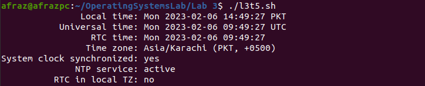

# Lab Quiz:

The lab quiz taken on the 6th of February, 2023. The tasks done on bash scripts and their corresponding outputs are shown below:

## Task 1:

### (a):Create a simple script which multiplies two command line arguments and outputs the answers.

We use the $ sign to get value of command line arguments. a and b are used to get value of the two command line arguments, then let evaluates the expression and outputs the result.

### 

The output 6 is outputted by entering arguments 3 and 2.

### (b):Create a simple script, which will ask the user for a few pieces of information then combine this into a message which is echo'd to the screen.

The $* directive imports all command line arguments. This is simply outputted in a string.

Any number of arguments can be passed after the shell script name. And they are outputted as the formatted string.

### (c):Now Mr. Tom suddenly lost the track of his current location. Help him find his location.

The pwd command lists the path of the present working directory. This is employed in the shell script.

The output is as follows. If this script is moved to another directory, the path changes accordingly.

### (d):He wants the list of all files present on home directory.

The ls command is employed for this purpose. First we change the path of the directory, then we simply list the contents of the directory.

First line of the output below lists the directory name as "/home/afraz" which indicates the home folder.

The contents of the directory are outputted.

### (e):Display the current time.

"timedatectl" is the linux script command for this purpose.

The output for this script will be:

### (f):Display a Thank you message.

This is done by a simple echo command.

The output will be:

## Task 2:

### (a):Write a simple shell script that uses arithmetic operators (+, -,*) using parenthesis with printing your own roll # with the results of
operations.

Two things need to be done in this task. First, we need to get the command line arguments, and then we need to concatenate the strings based on that. Arithmetic manipulation in shell is employed by parantheses, we manipulate the value of command line arguments. Then, string concatenation into roll numbers occurs by the use of "+=" operator. The code is below:

.png)

Output of the above script is as below. The arguments passed were 3 and 2, corresponding to 

1. 3+2 = 5 (2021-CS-5)
2. 3*2 = 6 (2021-CS-6)
3. 3/2 = 1.5 ~ 1 (2021-CS-1)

