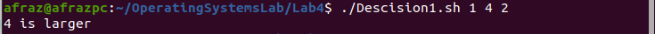
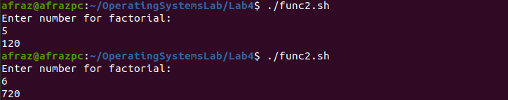

# Lab manual

### Description: 

This manual aims to familiarize the user with basic loops and command line arguments of linux bourne shell.

### Part 1: Decisions

#### Description and Syntax:

Decisions are taken based on some particular value or input.

 ``` Syntax of if statements:``` 

​	``` if(some test) ```

​	``` then do something```


 ``` Syntax of if statements in linux:``` 

​	``` if [ some test ]; ```

​	``` then do something```

Now, linux uses the basic if-else block for its decision taking. Further examples will be given in the sample tasks below. 

#### Tasks:

1. Create a script that takes 3 command line arguments and prints the larger of the three numbers.

   This uses the simple concept of two if and one else statements. First we get the three command line arguments by the  ```$``` directive. Then, as the user can see in the attached screenshot, the linux syntax of flag based if-else is given below. One can also utilize c++ based if else, they come in double brackets, example syntax ``` if (( some test in c++ syntax))```. 

   This code gives the output corresponding to : 

   2.  Create a bash script that prints different output corresponding to day of week.

      ​	``` switch case syntax in linux```

      ​	``` case $VALUE in```

      ​	```case 1) ....```

      ``` case 2) ....```

       ```esac   #ends the switch block```

      We use a switch case in this task. First, we use the ```date=$(date +%u)``` to convert the day to an integer value. Then we apply a switch case to check what was the day and print the message. The syntax of a switch statement can be seen in the code block attached below. Generally, an switch block is not recommended for usage because of readability issues.

This code gives the output of:

### Part 2: Loops

#### Syntax:

```Syntax of a for loop```

```for i in {values} ```

```do```

```#do something```

```done```


```Syntax of a while loop```

```while [ some test ]```

```do```

```#do something```

```done```

#### Tasks:

3. Create a script that prints each number from 1 to 10 and whether they are even or odd.

   We use the if-else block covered in first part of the manual to check whether the number is even or odd. A simple for loop is required in this case, whose syntax can be seen in the image below.

   The output for this is: 

   4. Create a bash script that adds all numbers in a command line arguments.

      Recall from Programming 101 that  a string is an array of characters. We simply traverse each character by character and add all values.

      

      The output for the code is:

      ### Part 3: Functions

      #### Description and Syntax:

      In functions, linux behaves a little differently.

      Basically, the syntax of a function is:

      ```function nameOfFunction(){```

      ​	```do something in function```

         ```echo $RETURN VALUE      #to return something if applicable```

      ```}```

      Here two important things are required for clarity.

      First of all, a clash may occur in global and local variables. This is resolved by ```local``` added before variable name.

      Secondly, the function call in linux differs from c++. Here, a function is called by the syntax:

      ```functionName $param1 $param2 ....```

      and they are *caught* in the function by the ```$``` directive.

      #### Sample Tasks:

   5. Create a shell script that checks for whether a number is a palindrome or not.

      This involves some mathematical computations. Else is simply loops and if statements covered in parts 1 and 2.

      

      

      The output for this script is

      7. Recursively calculate the factorial of a number.

         Recursion is when a function calls itself.  There needs to be given a break condition for the function else the recursive call will overflow the stack. The code is: 

      The output:

      

      