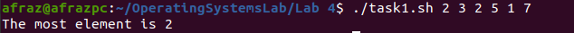

# Bash Scripting and Arrays

Arrays are important concepts in programming or scripting. Arrays allow us to store and retrieve elements in a list form which can be used for certain tasks. In bash, we also have arrays that help us in creating scripts in the command line for storing data in a list format. In this article, we will understand the basics of arrays in bash scripting.

Generally, arrays in bash script don't work like they work in c++ . In c++, arrays are consecutive memory locations, which allow us to retrieve and access data based on an index. In bash scripting, out of bound array can be accessed, but they need to be allocated memory.

## New Commands to know

```
'%INTs' # Here, the %sign frees up space by the INT factor, and s tells that it is the space to be freed.
```

```
$[arr[INT]] #accesses the array value on an INT param, and ${#arr[INT]} gives the length of a string array on INT param.
```

## Hands-on Tasks

1. Create a bash script that finds the most occuring element in an array.

   Here, we pass the array as an argument to the script. Basically, we first check that if the command line arguments were empty (*lines 1-3*), then no array was passed. But if there was an array passed as a command line arg, then we need to loop over elements of the array(*lines 5 onward*) and find the most occuring element in the array.

   The code for this is:

   ```bash
   #!/bin/bash
   
   if [ -z "$1" ]; then
      echo "No array was passed"
      exit 1
   fi
   
   array=($1)
   
   most_occur=0
   
   for i in "${array[@]}"
   do
      count=0
      for j in "${array[@]}"
      do
         if [ $i -eq $j ]; then
            ((count++))
         fi
      done
      if [ $count -gt $most_occur ]; then
         most_occur=$i
      fi
   done
   
   echo "The most element is $most_occur"
   ```

   

   

   At line 20 is the heart of this script. Here we are reassigning each elements occurence with the updated value of the next most occurence which holds a greater priority.

   The output of this script will be:

   

2. Create a Bash script to find the largest element of a given array of integers.

   This concept involves the simple algorithm of picking up the largest element from the array. We loop over the array, and for each iteration, we loop over again and store an element in the largest variable.

   The code for this is:

   ```bash
   #!/bin/bash
   
   array=(5 10 15 20 25 30 35 40 45 50 55 60 65 21)
   
   max=${array[0]}
   
   for i in "${array[@]}"
   do
       if (( $i > $max ))
       then
           max=$i
       fi
   done
   
   echo "The largest element in the array is: $max"
   ```

   

   The output for this script is:

   

   

   3. Create a Bash script to separate 0s and 1s from a given array of values 0 and 1.

      First we declare an array of 0's and 1's *(line 1)*. Then in *(line 2,3)*, we  specify the auxilary array to store 0's and 1's. Then a, simple loop runs over the array, and an if-statement to check the element is equals 0, putting in zero array else put it in ones array *(lines 8 to 16)*. Then we simply print the arrays.

      ````bash
      #!/bin/bash
      
      arr=(0 0 1 1 0 1 0)
      
      zeros=()
      ones=()
      
      for i in "${arr[@]}"
      do
          if [ $i -eq 0 ]
          then
              zeros+=("$i")
          else
              ones+=("$i")
          fi
      done
      
      echo "Zeros Array: ${zeros[@]}"
      echo "Ones Array: ${ones[@]}"
      
      ````

      

      

      The output for this script is:

      

      4. Create a Bash script to find the first repeating element in an array of integers.

         This is a full-fledged hands on task. 

         ```
         First, we declare the array and print it. (line 3,4)
         ```

         ```
         Secondly, we run a forward loop on the array by the syntax "${!arr[INT]}" ( this is another syntax to run a index-base array traversal loop).(line 5)
         ```

         ```
         We run an inner loop from the current index i till the end. If any element is same as before, the first repeating element in the array is found. (line 6)
         ```

         ```
         Upon this condition, we enter the the third for loop on line 10. What this for loop does is that it traverses the entire array and counts the occurences of the elements. (lines 10-13)
         ```

         The code for this is:

         ```bash
         #!/bin/bash
         
         arr=(5 6 3 2 8 6 5 1 9)
         echo "The Array is ${arr[*]} " 
         for i in "${!arr[@]}"; do
           for j in "${arr[@]:$i+1}"; do
             if [[ $j -eq ${arr[$i]} ]]; then
               echo -n " The first repeating element was ${arr[$i]}"
               count=0
               for k in "${arr[@]}"; do
               		if [ ${arr[$i]} == $k ]; then
               			(( count=count+1 ))
               		fi
               		done
               	echo " And The count of its repetition is $count"
               exit 0
             fi
           done
         done
               
         echo "No repeating elements found"
         exit 1
         
         ```
         
         
         
         

         And the output is:

         

         

   