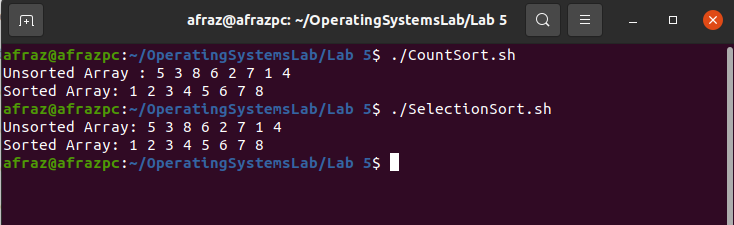

# Sorting Algorithms

Sorting algorithms are algorithms that rearrange elements of an array or collection in a certain order. Common orders are numerical order or lexicographical order. Common sorting algorithms include insertion sort, selection sort, quick sort, merge sort, and heap sort.

## Selection Sort, Pseudocode and Bash Script:

Selection Sort is a sorting algorithm that iterates over an array, finds the smallest element and places it at the beginning of the array. This process is repeated for each of the remaining elements, and the algorithm continues until the entire array is sorted.

### Pseudocode:

```pseudocode
Procedure: SelectionSort(A) 

Input: An array A of n elements

Output: An array A' with the same elements as A, sorted in ascending order 

 For i = 0 to n-2 do

   	min = i 

​		For j = i + 1 to n-1 do 

​				  If A[j] < A[min] then   min = j 

​		 End For 

​		Swap A[i] and A[min] 

 End For
```

### Explanation: 

We loop through the array, starting at index 0. We set the minimum element to the current index, i. We then loop through the remaining elements and compare each element to the current minimum. If we find a smaller element, we assign it as the new minimum element. After this loop is complete, we swap the current minimum with the first element in the array. We then repeat the process for the rest of the elements in the array, ending when the entire array is sorted.

### Bash Script and Line by line walkthrough:

``````bash
#!/bin/bash

arr=(5 3 8 6 2 7 1 4)

n=${#arr[@]}
echo "Unsorted Array: ${arr[@]}"
for (( i=0; i<n-1; i++ ))
do
    
    min_idx=$i

    for (( j=i+1; j<n; j++ ))
    do
        if (( ${arr[$j]} < ${arr[$min_idx]} )); then
            min_idx=$j
        fi
    done

   
    if (( $min_idx != $i )); then
        temp=${arr[$i]}
        arr[$i]=${arr[$min_idx]}
        arr[$min_idx]=$temp
    fi
done

echo "Sorted Array: ${arr[@]}"
``````

In this piece of code, what we have first done is that we have declared the array we want to sort. Then we are running a loop over the array, and each index we are treating as the minimum index (*selecting*). Then, we simply compare that from that point forward  (*the j-for loop in line 12*), we check if the value at the current position of the j-index was less than the value we started with initially (*the min-index*). Then, if the min-index was changed during the inner for-loop execution, we swap the elements.

## Counting Sort, Pseudocode and Bash Script:

Counting sort is an algorithm for sorting a collection of objects according to keys that are small integers; that is, it is an integer sorting algorithm. It operates by counting the number of objects that have each distinct key value, and using arithmetic on those counts to determine the positions of each key value in the output sequence. Its running time is linear in the number of items and the difference between the maximum and minimum key values, so it is only suitable for direct use in situations where the variation in keys is not significantly greater than the number of items.

### Pseudocode:

``````pseudocode
//COUNTSORT(A)

//Input: An array A of n elements and the range of values R

//Output: An array B of the same length as A, sorted

1. Create an array C of length R

2. Initialize every element in C to 0

3. For each element x in A, increment C[x]

4. For each index i in C, C[i] now contains the number of elements equal to i

5. For each index i in C, add C[i] to the element before it

6. Create an array B of length n

7. For each element x in A, place it into B[C[x]]

8. Return B
``````

### Explanation:

``````bash
#!/bin/bash

arr=(5 3 8 6 2 7 1 4)
echo "Unsorted Array : ${arr[@]}"

range=10

declare -a count=()
for (( i=0; i<range; i++ ))
do
    count[$i]=0
done

for (( i=0; i<${#arr[@]}; i++ ))
do
    (( count[${arr[$i]}]++ ))
done

for (( i=1; i<range; i++ ))
do
    (( count[$i]+=count[$i-1] ))
done

declare -a temp=()
for (( i=${#arr[@]}-1; i>=0; i-- ))
do
    (( temp[--count[${arr[$i]}]]=${arr[$i]} ))
done

for (( i=0; i<${#arr[@]}; i++ ))
do
    arr[$i]=${temp[$i]}
done

echo "Sorted Array: ${arr[@]}"


``````

What we have done is that we have initialized an array of counters. We then assign the counters to the array, finally placing the array at temps where it ought to be.

## Execution demo:

