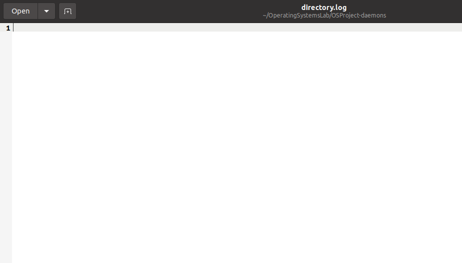
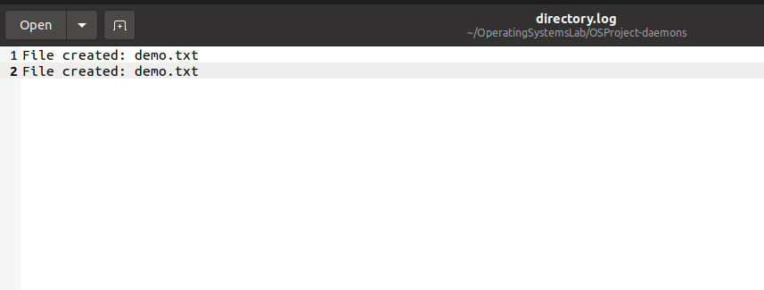
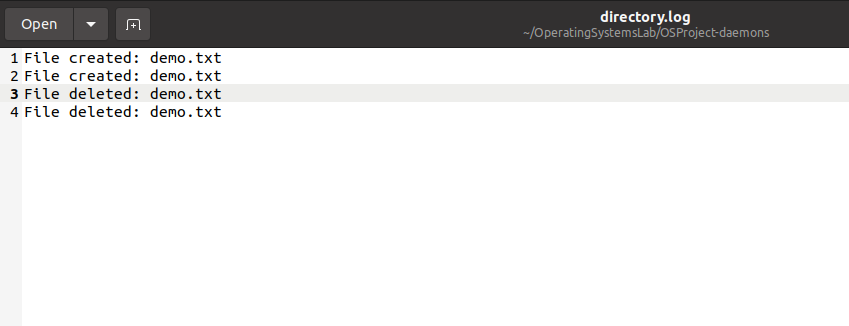

# Daemons

A daemon (pronounced DEE-muhn) is a program  that runs continuously as a background process and  wakes up to handle periodic service requests, which  often come from remote processes.

The daemon program is alerted to the request by the operating system (OS), and it either responds to the request itself or forwards the request to another program or process as appropriate.

Common daemon processes include print spoolers, email handlers and other programs that manage administrative tasks. Many Unix or Linux utility programs run as daemons. For example, on Linux, the Network Time Protocol ([NTP](https://www.techtarget.com/searchnetworking/definition/Network-Time-Protocol)) daemon is used to measure time differences between the clock on the computer it runs on and those of all other computers on the network. A time daemon runs on each of the host computers, with one being designated as primary and all others as secondary. Secondary daemons reset the network time on their host computer by first sending a request to the primary time daemon to find out the correct network time.

#### An Important Point: 

Daemons(although they are background processes) are slight different from background processes.

### Part 1- Knowing Daemon Processes

The following command

```ps aux | grep <process_name>``` can be used to access the list of daemon processes currently running in the linux system. They are identified by the ```-d``` ending in their name. The ```| grep <process>``` is used for filtering criteria.

#### Example:

For example, when I run the following command

```ps aux | grep mysqld``` 

I get on my system: 

```mysql     3933  0.0  1.2 418616 46832 ?        Ssl  10:21   0:00 /usr/sbin/mysqld```

Which is the process behind the daemon running the SQL client on the server. Note that while filtering, I passed the criteria ```mysqld``` which indicates to the linux system that ```mysql``` is a daemon process. As the output suggests, ```3933``` is the process ID of the SQL client on the server.

### Part 2- Building a custom daemon on the Linux machine

Daemons are fairly simple to build. What lies as a real challenge is that we have to configure it's working such that the independent daemon is synchronized with the desired action.

For this example, we will build a daemon that watches a directory for changes, and logs all the changes (additions/deletions) to a log file.

**Note: ** **It is important to follow this manual till the end, then replicate the code. Else some steps may remain incomplete, causing a memory leak.**

Let's walk step by step in building it.

1.  Import the necessary libraries and target event functions.

```c++
#include <iostream>
#include <fstream>
#include <sys/inotify.h>
#include <unistd.h>
#include <string>
#define EVENT_SIZE (sizeof(struct inotify_event))
#define EVENT_BUF_LEN (1024 * (EVENT_SIZE + 16))
```

In this snippet, the ``iostream`` and ``fstream`` headers are used to manipulate output and file handling(for logs). The ```sys/inotify.h``` is used to raise, what we call a daemon-interrupt. Basically, it will raise an exception(sort of) that we can further tackle in the ``EVENT_SIZE`` variable. It has already been configured to be the size of the daemon-interrupt. Similarly, a buffer for the daemon is also created in the memory.

2. Next up, a fairly simple file handling function is defined. This file handling function simply opens up a file and writes the event to the file.

```c++
void log_event(std::string event) {
    std::ofstream log_file("directory.log", std::ios_base::app);
    if (log_file.is_open()) {
        log_file << event << std::endl;
        log_file.close();
    } else {
        std::cerr << "Error: Could not open log file" << std::endl;
    }
}
```

​	Now, from this point forward, all code is to be written in main functions.

3. We start by declaring some variables and watch functions.

``` c++
int fd,wd;  
char buffer[EVENT_BUF_LEN];

// Change working directory to directory where executable is located

if (chdir("/path/to/where/directory") < 0) {

	std::cerr << "Error: Could not change working directory" << std::endl;

   //return 1;
}
```

Fist, we have to change the working directory to where the executable is located. In other words, this will be the directory where we are watching the changes and this is the directory where we will log the events.

The initialization of the ``fd`` and ``wd`` occurs as follows: (Be sure to replace ``/path/to/where/directory``) with the actual path of the folder where the executable is located:

``````c++
 fd = inotify_init();
 if (fd < 0) {
      std::cerr << "Error: Could not initialize inotify" << std::endl;
      //return 1;
 }
``````

```c++
 wd = inotify_add_watch(fd, "/path/to/where/directory", IN_CREATE | IN_DELETE);
if (wd < 0) {
      std::cerr << "Error: Could not watch directory" << std::endl;
      //return 1;
}
```

Let's walk back a moment and look what these mean. The ``fd`` (forward directory) initialization is a fairly straightforward function. But however, the ``IN_CREATE`` and ``IN_DELETE`` parameters in the ``wd`` initialization are specific parameters. ``IN_CREATE``means that this directory should be watched for any file create event (*create events also encompass copying any file into this directory*), while ``IN_DELETE`` means to watch for removal of files.

4. Now, we are going to fork the parent process for daemon initialization (*remember that daemon is a background process, after all.*)

```c++
// Fork to create a daemon process
pid_t pid = fork();
if (pid < 0) {
     std::cerr << "Error: Could not fork daemon process" << std::endl;
     return 1;
} else if (pid > 0) {
     return 0; // Exit parent process
}
```

5. Now, we are going to implement the loop that will continuously monitor the directory for add/delete events.

`````c++
// Child process continues to monitor directory for changes
while (true) {
    int length = read(fd, buffer, EVENT_BUF_LEN);
    if (length < 0) {
        std::cerr << "Error: Could not read directory changes" << std::endl;
        return 1;
    }

    int i = 0;
    while (i < length) {
        struct inotify_event *event = (struct inotify_event *) &buffer[i];
        if (event->len) {
            if (event->mask & IN_CREATE) {
                log_event("File created: " + std::string(event->name));
            } else if (event->mask & IN_DELETE) {
                log_event("File deleted: " + std::string(event->name));
            }
        }
        i += EVENT_SIZE + event->len;
    }
}
`````

When an event occurs, the program reads the event data using the `read()` system call, which blocks until an event is available. The event data is stored in the `buffer` variable, which is a character array of length `EVENT_BUF_LEN`.

The code then iterates over the events in the buffer using a `while` loop that starts at the beginning of the buffer and advances to the next event by adding the size of the current event to the current index.

For each event, the code checks if the `len` field of the event is nonzero, which indicates that the `name` field contains the name of the file that triggered the event. If the event is a file creation event, the program logs a message indicating that a file was created, along with the filename. If the event is a file deletion event, the program logs a message indicating that a file was deleted, along with the filename.

###### Step by Step Explanation of the function

Let's take a moment and walk step by step in this code. (*This is the code block that essentially powers the daemon*)

1. The code starts with an infinite loop `while(true)` that continuously monitors the directory for changes using the ``inotify`` library in linux.
2. Inside the loop, the code uses the `read()` system call to read events from the ``inotify`` file descriptor associated with the monitored directory.
3. If the `read()` call fails, the program prints an error message and exits with a non-zero return code.
4. The code then iterates over the events in the `buffer` variable using a `while` loop that starts at the beginning of the buffer and advances to the next event by adding the size of the current event to the current index.
5. For each event, the code checks if the `len` field of the event is nonzero, which indicates that the `name` field contains the name of the file that triggered the event.
6. If the event is a file creation event (`IN_CREATE`), the code logs a message indicating that a file was created, along with the filename.
7. If the event is a file deletion event (`IN_DELETE`), the code logs a message indicating that a file was deleted, along with the filename.
8. If the event is not a file creation or deletion event, the code does nothing.


Finally, if our code was unreachable, we exit the executable.

```c++
return 0;
```

**Note:** More information about file modes and the  documentation of the ``inotify.h`` API can be found at lines 29-40 of:

[Inotify Documentation](https://docs.huihoo.com/doxygen/linux/kernel/3.7/include_2uapi_2linux_2inotify_8h_source.html)

### Complete Code:

The complete code is given below and in the accompanying ``daemons.cpp`` file.

```c++
#include <iostream>
#include <fstream>
#include <sys/inotify.h>
#include <unistd.h>
#include <string>

#define EVENT_SIZE (sizeof(struct inotify_event))
#define EVENT_BUF_LEN (1024 * (EVENT_SIZE + 16))

void log_event(std::string event) {
    std::ofstream log_file("directory.log", std::ios_base::app);
    if (log_file.is_open()) {
        log_file << event << std::endl;
        log_file.close();
    } else {
        std::cerr << "Error: Could not open log file" << std::endl;
    }
}

int main() {
    int fd, wd;
    char buffer[EVENT_BUF_LEN];

    // Change working directory to directory where executable is located
    if (chdir("/home/afraz/OperatingSystemsLab/OSProject-daemons") < 0) {
        std::cerr << "Error: Could not change working directory" << std::endl;
        //return 1;
    }

    fd = inotify_init();
    if (fd < 0) {
        std::cerr << "Error: Could not initialize inotify" << std::endl;
        return 1;
    }

    wd = inotify_add_watch(fd, "/home/afraz/OperatingSystemsLab/OSProject-daemons", IN_CREATE | IN_DELETE);
    if (wd < 0) {
        std::cerr << "Error: Could not watch directory" << std::endl;
        //return 1;
    }

    // Fork to create a daemon process
    pid_t pid = fork();
    if (pid < 0) {
        std::cerr << "Error: Could not fork daemon process" << std::endl;
        return 1;
    } else if (pid > 0) {
        return 0; // Exit parent process
    }

    // Child process continues to monitor directory for changes
    while (1) {
        int length = read(fd, buffer, EVENT_BUF_LEN);
        if (length < 0) {
            std::cerr << "Error: Could not read directory changes" << std::endl;
            return 1;
        }

        int i = 0;
        while (i < length) {
            struct inotify_event *event = (struct inotify_event *) &buffer[i];
            if (event->len) {
                if (event->mask & IN_CREATE) {
                    log_event("File created: " + std::string(event->name));
                } else if (event->mask & IN_DELETE) {
                    log_event("File deleted: " + std::string(event->name));
                }
            }
            i += EVENT_SIZE + event->len;
        }
    }

    // Unreachable code
    return 0;
}


```

### Part 3- Demonstration

Log before anything:

Log after creating:



Log after deleting:




# Feel Free to Ask any questions!