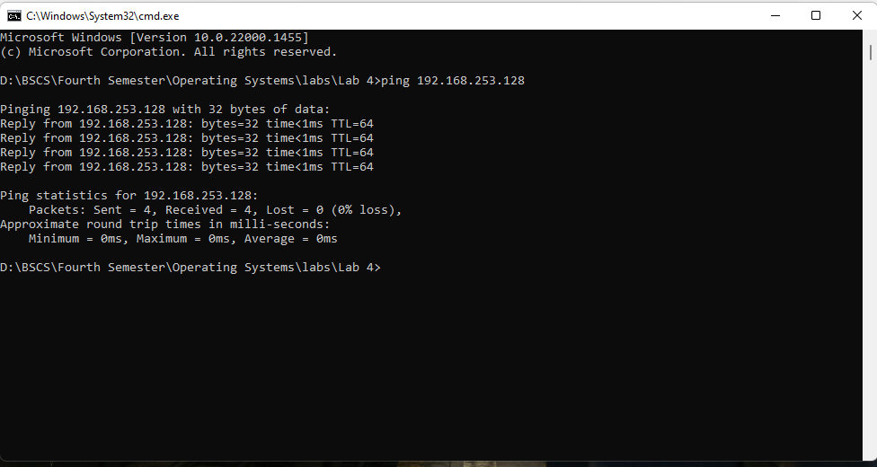
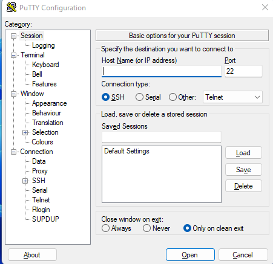

# Introduction to SSH

SSH (Secure Shell) is a network protocol that provides a secure connection between two computers over an unsecured network. It is used to securely transfer files, execute commands, and manage networks. It is an important tool for system administrators and other users who need to be able to access remote systems securely.

This is an important concept in cloud and server communication, because while deploying a website maybe our server is in some remote location. So the USB model fails to fulfill our purpose.

## How is it accomplished between Windows and Linux?

It is possible to access a linux machine from windows, and vice versa. But first, some configuration needs to be done on the windows and linux machines.

### Part 1 - Configuring the Linux Machine:

1. Run the command **sudo apt-get install openssh-server** on the terminal of your linux machine. This will install the openssh server. A screen like this will appear.

2. Now, when it is done, run this command **sudo apt install net-tools**. This is because by default, linux is an extremely secure operating system and we can not get the IP address of the machine normally. A screen like this will appear.

3. Now, we have all the configuration on the linux machine. We only need to get the IP address now. For this purpose, run the **ifconfig** command. What it does is that, it churns out the IP address for clusters as well as individual users too (*recall the concept of groups and users in linux*).The highlighted part is the IP of our linux machine. 

   You can also check if the IP exists from windows too by the ping command.This shows that the IP exists.

   ### Part 2: Configuring the Windows machine:

   Now here is where things get a little bit tricky. There is an important thing to keep in mind from here.

   ​	```1) Windows uses back-slash for file separation e.g "C:\\so on. Linux uses forward slash e.g home/user/so on"```.

   Let's start configuring the windows machine.

   #### Downloading PuTTY

   PuTTY is a free and open source terminal emulator, serial console, and network file transfer application. It is primarily used to connect to remote computers and manage networks, systems, and configurations. PuTTY supports a wide variety of protocols, including SSH, telnet, rlogin, and raw TCP protocols. It can also be used to securely transfer files using SCP and SFTP.

   1. Go to this website [Download PuTTY - a free SSH and telnet client for Windows](https://putty.org/).

   2. Download the first link that appears, and install it.

   3. After it is installed, open it.

   4. You will see this kind of window.

      

      Here, the Host_Name is the IP of the linux machine we found in step 3 of Part 1. Put that here. The port number (*specified here as 22*) is also important because it tells our machine where to connect with the other machine. *(This concept is analogous to connecting two computers with a wire)*

      

      5. Once You press open, the putty console will ask for your linux username and password. Enter them, and *voila*. You have entered your linux prompt from within your windows. You can check for your directories using the ls command.

   

   

   ### Part 3 - Transferring Data

   #### 3-1: From Windows to Linux

   Open up the location where PuTTY is installed. In Windows, this will most probably in the Program Files Folder. Open up the cmd window from there and type this command

   **pscp -P 22 "FromWindowsDirectory" "ToLinuxDirectory"**

   Keep in mind the rule we discussed earlier in part 2 about back and forward slashes. The working of this example is discussed below, the syntax and methodology is exactly the same.

   #### 3-2: From Linux to Windows

   Open up the location where PuTTY is installed. In Windows, this will most probably in the Program Files Folder. Open up the cmd window from there and type this command

   **pscp -P 22 "FromLinuxDirectory" "ToWindowsDirectory"**

   Keep in mind the rule we discussed earlier in part 2 about back and forward slashes.

   

   We can see that the file was transferred to windows in the D directory.

### Important:

Keep the syntax of the command, exactly the same as it appears in the screenshot above. /home/user is the linux directory that is default open to ssh transfers. And, the separator in windows is \\\. 